# Junior Club website

## User-Centric Frontend Development Milestone Project.

---

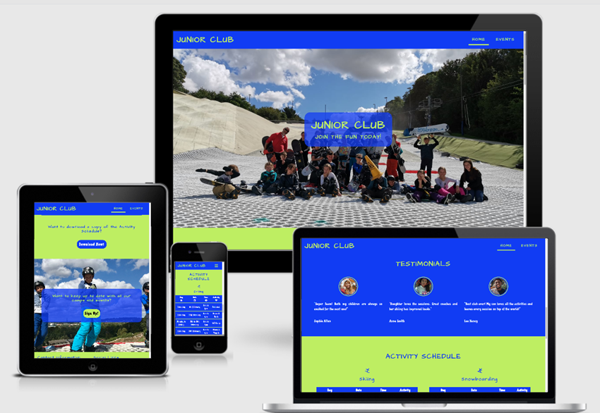

This site has been created to help promote Junior Club and to allow parents of the junior participants a place to source all information they may be looking for regarding schedules, events, contact information and more. The aim is to create a fluid, userfriendly site that also looks appealing and is consitant with the groups goals and colour schemes for consitancy and brand image.

---
---

## Table of contents

---

- [UX](#ux)
    - [Project Goals](#project-goals)
    - [User Goals](#user-goals)
    - [User Stories](#user-stories)
    - [Wireframes](#wireframes)
    - [Surface](#surface)
- [Features](#features)
    - [Navigation Bar](#navigation-bar)
    - [Home Page](#home-page)
    - [Events Page](#events-page)
    - [Gallery Page](#gallery-page)
    - [Future Features](#future-features)
- [Tecnologies used](#technologies-used)
- [Testing](#testing)
    - [Functionality Testing](#functionality-testing)
    - [Compatibility Testing](#compatibility-testing)
    - [User Story Testing](#user-story-testing)
    - [Issues and bugs](#issues-and-bugs)
    - [Performance Testing](#performance-testing)
    - [Code Validation](#code-validation)
- [Deployment](#deployment)
- [Credits](#credits)
    - [Learning resources and styling ideas](#learning-resources-and-styling-ideas)
    - [Code](#code)
    - [Images Used](#images-used)
- [Other Information](#other-information)
    - [Git commits](#git-commits)
    - [Wireframes Design Changes](#wireframe-design-changes)
    - [Social Links](#social-links)
    - [Reasons for coding format](#reasons-for-coding-format)
- [Project Screenshots](#project-screenshots)

---
---

## UX

---

### Project goals

The primary goal of the Junior Club website is to provide parents information regarding the clubs times, events and camps. This site has two main audience's: new customers - parents of young skiers and snoboarders looking to find out what is involved and potentially join the the Junior Club programme and returning customers - parents of young skiers and snowboarders that are aleardy part of this programme looking to find out about upcoming events and the weekly schedule.

### User goals

#### New user goals:

* User is able to find out what's involved in the club.
* User can find out how to join the club.
* User can see when sessions are and what activities are on.

#### Returning user goals:

* User can view upcoming events.
* User can view upcoming activities.
* User can sign up for email updates about events, camps and activity schedule.

### User Stories

#### As the Camp Lead Coach and website owner:

* I would like to present the club to potential new custom in a clear and visually pleasing way.
* Keep existing members up to date with events and camps.
* Increase our contact database.
* Post weekly activities.

#### As a new customer:

* I would like to find out what the club is about.
* I wish to know how to join the group.
* I would like to know how much it costs and when the session are.
* I would like to read customer reviews or testimonials.

#### As a returning customer:

* I would like to check what activities are coming up.
* I would like to view upcoming events and camps.
* I wish to sign up to a newsletter to keep up to date.

### Wireframes

I used [Balsamiq.com](https://balsamiq.com/) to create the wireframes.

Home Page

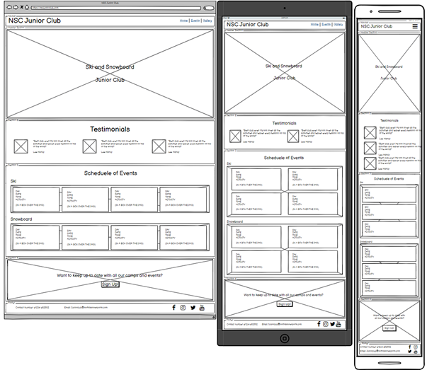

Events Page

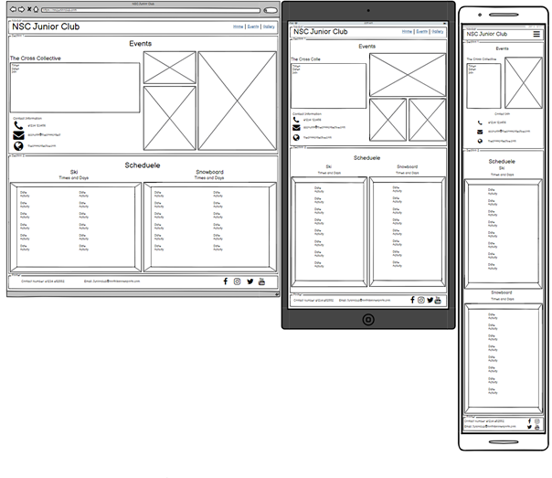

Gallery Page

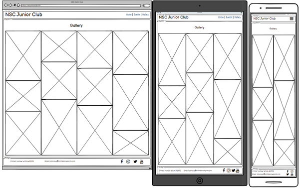

### Surface

#### Colours

Main colours used in project:

* #BEEE62 - Primary colour one
* #113CF3 - Primary colour two
* #fff - used for paragraphs and buttons to contrast with primary colour two
* #000 - used for paragraphs and buttons to contrast with primary colour one

#### Fonts

* Primary font - 'Architects Daughter' chosen because it resembles a childs had writing, is easily ledgable and has a playful feel to it.
* Secondary font - 'Chicle' chosen as it also has a playful feel to it.
* Back-up font - 'sans-serif' chosen as a back-up as standard.

#### Images

* I used images from [Unplash.com](https://unsplash.com/) and these images are credited in the credits section.
* I also used some images taken of our Junior Group. I have permission to use these images.

Back to [Table of Contents](#table-of-contents)

## Features

---

The website consists on 3 pages home, events and gallery. The websites features are listed below:

### Navigation bar

* Navbar has a fixed position at the top of every page. It is responsive and for extra small devices, mobile devices, this list of pages will collapse into a burger menu.
* The site logo/title on the left side can be used as a link back to the home page.
* The page names on the right can be used to navigate back and forth between home, events and gallery.

### Home page

#### Hero Image Sections

* The section has a clear title and call to action. This action being join the fun today! To encourage others to join.

#### About Us Section

* Clearly defined sections of text so users do not have to read evenything and can got directly to the part they want to know about for example skiing on snowboarding.
* Icons of skiers and boarders used about their respective titles sso even at a glance you can see what might be of interest to read.

#### Testimonials

* Short and to the point testimonials so people can have an idea of what others think of the club.
* Images of the quote authors are shown at medium screen size and above. This breaks the text up a little and provides a little secruity that these testimonials where written by actual customers.

#### Activity schedule

* Tables used to list the activities as this is a clear and easy way to find out what's comming up.
* seperate tables for skiers and snowboarders so customers are not confused and turn up to the wrong sessions.
* Call to download and button that allows people to download a pdf of the upcoming schedule. This will open in a blank page so the user doesn't lose their place on the page.

#### Sign Up Section

* Call to action encouraging users to sign up for updates.
* Sign up button that opens a modal where users can submit their name and email. The use of a modal allows the user to keep their position on a page.

#### Footer

* Contact information for the group leader provided if peope wish to call or email.
* Links to social media pages so users can easily navigate to social pages of the group. These will open in a blank page so the user doesn't lose their place on the page.

### Events page

#### About Events Section

* Short description explaining a little about the events and camps.
* Another call to action button to try and grab the attention of anyone missed on the home page. This opens a modal where users can submit their name and email. The use of a modal allows the user to keep their position on a page.

#### Event Listing Sections

* Clear Organisation name
* Table to show the events date, time, price and activities involved.
* A small paragraph about the organisation.
* Contact information for the organisers.
* Image from the organiser showcasing their events or and athlete that has attended.

### Gallery Page

* Cleary defined symmetrical photos.
* Photos per page width changes depending on screen width.

### Future Features

* Results Page - A page users can visit to see results of recent events.
* User Profiles - A login button to allow users to login to idvidual profiles.
* Profile Page - This chould have information regarding to their childs performance within the group including feedback, rankings, exercises and more.
* Shop - Allows parents to purchase the junior club merchandise through an online store.
* Add maps of where the events and camps take place and the home slope.

Back to [Table of Contents](#table-of-contents)

---
---

## Technologies used

---

#### HTML5

* Used as a structural language.

#### CSS

* Used as a style language.

#### Bootstrap

* [Boostrap](https://getbootstrap.com/) Version 4.3.1 used as a CSS framework to aid responsive design. A mobile first approach was taken.

#### Font Awesome

* [Font Awesome](https://fontawesome.com/) was used for social links, skiing and snowboarding headings and for table headings.

#### Google Fonts

* [Google Fonts](https://fonts.google.com/) used as a font resource.

#### GitHub

* [GitHub](https://github.com/) was used as the sites repository.

#### Gitpod

* [Gitpod](https://gitpod.io/workspaces/) was used as a development hosting platform.

#### Wireframes

* [Balsamiq.com](https://balsamiq.com/) was used as a wireframe tool to sketch the structure of the site.

Back to [Table of Contents](#table-of-contents)

---
---

## Testing

---

### Functionality Testing

I used google chrome developer tools throughtout the project to text everything as I was working on it.

Tested:

#### Responsiveness

Expected - The site is expected to respond to different screen sizes.

Testing - Tested this by expanding and contracting the windown size inside google inspect.

Result- Site responded as expected to all screen sizes 320px and up.

#### Navbar links

Expected - Navbar links and title will direct to the respective page and the title will act as an additional home link.

Testing - Clicked on all the links inside each page.

Result - All navbar elements working.

#### Test text to background colour contrast

Expected - it's expected that their is a clear contrast between text colour and background color throught the site.

Testing - Used google select to hover over all texts and check contrast is ticked. Also read everything to check it was all clearly visable.

Result - All text has a good contrast between itself and background color.

#### Buttons

Expected - Buttons will direct the user to the desired outcome in this case a pdf document for the download now button and a sign up modal for the sign up button.

Testing - Clicked on the buttons to see what happened. Also checked the :hover class was working when moving on and off the buttons.

Result- All buttons responded as expected.

#### Social Links

Expected - To be directed to the respective site.

Testing - Clicked on all social links to see where they linked to. Also checked the :hover pseudo element is working by hovering on and off the links.

Result - All links responded as expected and linked to the appropriate sites.

#### Event Contact Links

Expected - To be linked to the event organisers site.

Testing - Clicked on a link to see where it linked to. Also checked the :hover pseudo element is working by hovering on and off the link.

Result - Links Respond as expected and link to the event organiser sites.

#### Tested Navbar responsiveness

Expected - Navbar items will stay inline fit within the page.

Testing - Tested this by expanding and contracting the windown size inside google inspect.

Result - Did not respond as expected on screen widths from 576px to 608px. The navbar links would squash the Junior Club title due to lack of spacing.

Fix - Changed the nav links padding to allow for more room.

#### Tested Modals

Expected - Able to input and submit information.

Testing - Open modal using sign up buttons, type information and submit.

Result - Functionality responded as expect however found an issue where button was reversing colors when pseudo :hover was active.

Fix - Change the :hover background colour to green so the button is always visable.

### Compatibility Testing

This site was tested across the following devices and browsers:

#### Devices

* Hp Laptop using windows 10 home
* Honor 20 pro mobile phone

#### Browsers

* Google Chrome
* Mozila Fox
* Microsoft Edge

### User Story Testing

#### As the Camp Lead Coach and website owner:

* I would like to present the club to potential new custom in a clear and visually pleasing way.
    * The sites has clearly defined sections and is responsponsive.
* Keep existing members up to date with events and camps.
    * The Activity Schedule and Events page are clearly label and defined making it easy to find out about events and camps.
* Increase our contact database.
    * There is two places on the site with a call to action and a sign up modal to try and encourage users to sign up.
* Post weekly activities.
    * Activity Schedule clearly formatted to make adding new information quick and easy.

##### Supporting screenshots

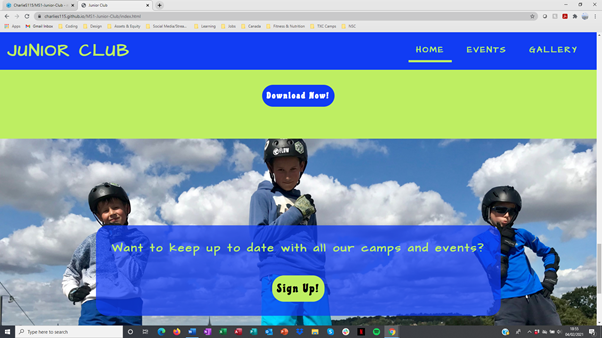
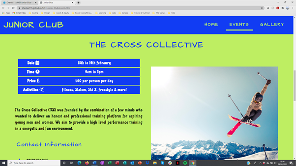

#### As a new customer:

* I would like to find out what the club is about.
    * About Us section provides all important information regarding the club.
* I wish to know how to join the group.
    * How to join is clearly labeled and explained inside the about us section.
* I would like to know how much it costs and when the session are.
    * Session information is clearly labeled and explained inside the about us section.

* I would like to read customer reviews or testimonials.
    * Testimonials section is clearly defined and easy to find in the homw page.

##### Supporting screenshots

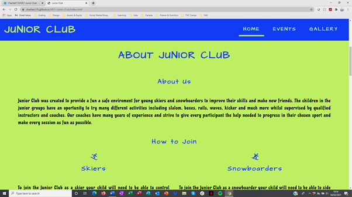
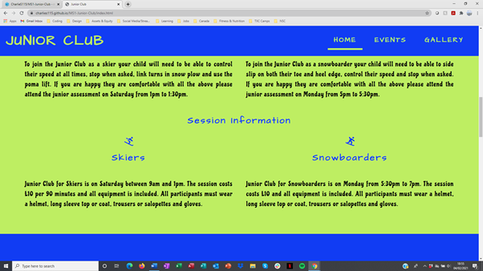

#### As a returning customer:

* I would like to check what activities are coming up.
    * The Activity Schedule section has the upcoming scedule and events listed and if users would like a more complete list there is a download button where they can download the activity schedule pdf.
* I would like to view upcoming events and camps.
    * Events page lists upcoming events and camps and they are sectioned seperately with all the iformation regarding an event within the section.
* I wish to sign up to a newsletter to keep up to date.
    * There is two places that a user can sign up, one on the home page and one on the events page. Both has call to actions and a sign up button.

##### Supporting screenshots

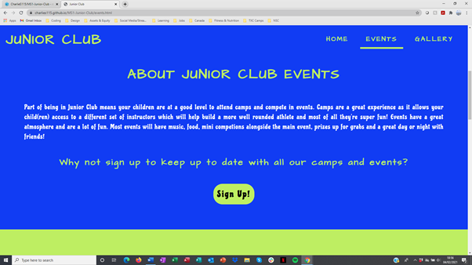

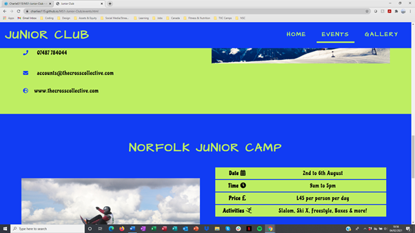
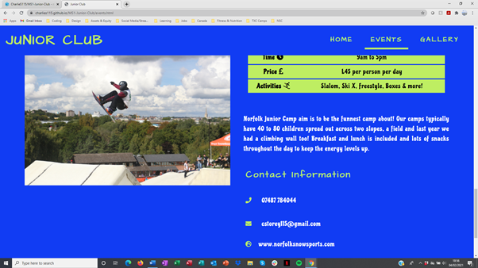

### Issues and bugs

All issues and bugs were found using google inspect and the responsive design tools. 

Below I have explaing the issue and how they were resolved:

* Overflowing Content triggering a x axis scroll bar.

This was happening due to Bootstraps .row margin having a -15px setting. To correct this I styled the .row class with a margin of 0. 

* Invisible hamburger menu.

The hamburger menu was active as you could see it highlight on google inpect when hovered over. To fix this the navbar-dark class was added to make this visable. Bootstrap CDN helped find the solution.

* Download button wasn't responding with colour change until the letters were hovered over.

This was an issue as clicking the button did nothing but clicking the letters linked to the pdf. This was fixed by adding padding to the a element to cover the button.

* Navbar title 'Junior Club' wasn't linking back to the home page.

This issue was caused by a typo in the href element.

* 3rd testimonials quote was displaying out of line on both the x and y axis.

This was a due to the class being set to col-sm-12. This was corrected by changing the class to col-12.

* Fixed issue where html wasn't passing validation as a element was inside button element.

Moved the classes from the button element to the a element then removed button element. Moved all the atributes from .activity-schedule button in css into the .activity-schedule a and a:hover classes.

Below are the before and after screenshots:

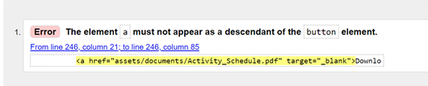
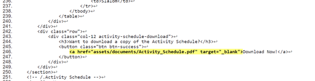
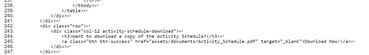

### Performance Testing

#### Mobile Devices

Before

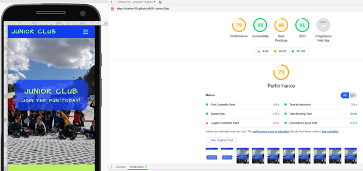

After Changes were made to increase these stats

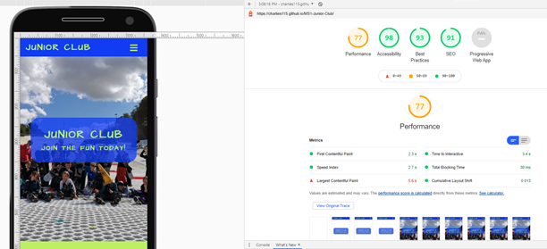

After adding gallery page and making changes to increse the page stats

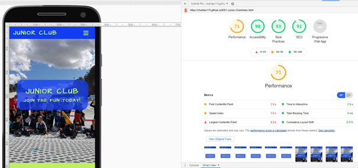

#### Desktop Devices

Before

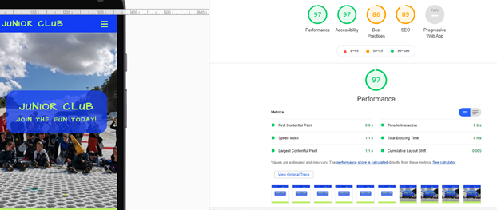

After Changes were made to increase these stats

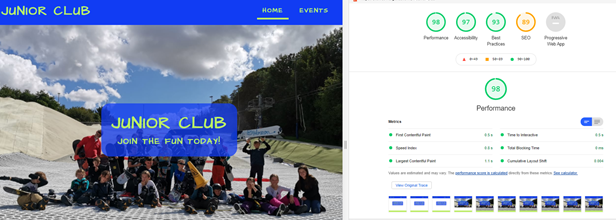

After adding gallery page and making changes to increse the page stats

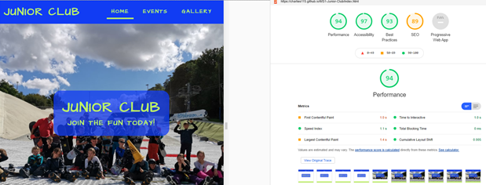

#### Changes made to improve stats

* Reduced the file size of the testimonial images
* Added alt attributes to all images
* Added rel="noopener" to all external link to improve performance.

#### Potential future changes to improve this further

* Import images in a different format
* Add meta tags to headings
* Reduce the amount of images used
* Import the fonts instead of linking

### Code Validation

At the end of the project I used the validators below to validate the HTML and CSS code.

* [W3C HTML Validator](https://validator.w3.org/#validate_by_input)
* [W3c CSS Validator](https://jigsaw.w3.org/css-validator/#validate_by_input)

Back to [Table of Contents](#table-of-contents)

---
---

## Deployment

---

This project was deployed on GitHub pages. I used Gitpod as a development enviroment where all changes were commited to the repository in GitHub.

To deploy the project I had to:

* Log into GitHub and open the MS1-Junior-Club repository.
* Got to settings and scroll down to GitHub pages.
* Select the first dropdown with 'none' and change to branch:master.
* Click save and then refresh the page.

The site is published at [https://charlies115.github.io/MS1-Junior-Club/](https://charlies115.github.io/MS1-Junior-Club/)

To run locally:

* Log into GitHub and open the MS1-Junior-Club repository.
* Select Code and click download zip file.
* After downloading you can save and open the file locally on your device.

Back to [Table of Contents](#table-of-contents)

---
---

## Credits

---

To complete this project I used Code Institute student template: [gitpod full template](https://github.com/Code-Institute-Org/gitpod-full-template)

### Learning resources and styling ideas

Throughtout learning with code institute I have researched and learn't using the following site and courses:

* [Code Institue](https://learn.codeinstitute.net/login?next=/dashboard)
    * Throughout this project I have refered back to lots of different moduls to refresh myself on good practices.
* [W3Schools](https://www.w3schools.com/)
    * I have used this site throughout the course when looking for ideas or potential stylings to code.
* [CSS-Tricks](https://css-tricks.com/)
    * I have occasional visted this site for ideas and potential fixes throughout the course.
* [Bootstrap](https://getbootstrap.com/)
    * Throughtout this project I have visted this site many time to create the pages structure and give ideas and coding examples.
    * I have also read up on ever class I have used to understand exactly what it will do to the site when used.
* [Stack Overflow](https://stackoverflow.com/)
    * I have visted this site a few times throughtout the course however I have avoided it whilst building this site as I wanted to workout how to do most of the code myself and not just see fixes.
* [Code Academy](https://www.codecademy.com/)
    * I have not visted this site recently however this is where I first started learning to code.

### Code

I have tried to do almost all the code and styling myself through trial and error and using google inspect.

Below are the exaples of code I have copied to complete this project:

* [Bootstrap - Modal](https://getbootstrap.com/docs/5.0/components/modal/)
    * The modal was originally copied from bootstrap library. This modal has been heavily modified.
* [Bootstrap - Navbar](https://getbootstrap.com/docs/5.0/components/navbar/)
    * The navbar was originally copied from bootstrap library. This has been heavily modified.
* [Bootstrap - Hamburger Menu](https://getbootstrap.com/docs/4.3/components/navbar/#how-it-works)
    * The hamburger menu was originally copied from bootstrap library. This has been heavily modified.
* [CSS-Tricks - Full Page Background Image](https://css-tricks.com/perfect-full-page-background-image/)
    * This was used to ensure the bckgroun images are loaded correctly across devices.

### Images Used

[Unsplash Images](https://unsplash.com/) 

* testimonial_img1.jpg - [Omid Armin](https://unsplash.com/photos/HtQLD6HOS94?utm_source=unsplash&utm_medium=referral&utm_content=creditShareLink)

* testimonial_img2.jpg - [Hisu Lee](https://unsplash.com/photos/u6LGX2VMOP4?utm_source=unsplash&utm_medium=referral&utm_content=creditShareLink)

* testimonial_img3.jpg - [Elizeu Dias](https://unsplash.com/photos/2EGNqazbAMk?utm_source=unsplash&utm_medium=referral&utm_content=creditShareLink)

* events_img1.jpg - [Victoire Joncheray](https://unsplash.com/photos/EF0UG0xFgnA?utm_source=unsplash&utm_medium=referral&utm_content=creditShareLink)

* event_one_img1.jpg - [Sebastian Staines](https://unsplash.com/photos/xZIFEPtRsRI?utm_source=unsplash&utm_medium=referral&utm_content=creditShareLink)

* gallery_img1.jpg - [Yann Allegre](https://unsplash.com/photos/8FG9tt8qZ-8?utm_source=unsplash&utm_medium=referral&utm_content=creditShareLink)

* photo10.jpg - [Jörg Angeli](https://unsplash.com/photos/2Gs29PjkAA4?utm_source=unsplash&utm_medium=referral&utm_content=creditShareLink)

All other images that are not credited above I have permisson to use by the subjects or their parents. I either took them myself or they were taken by a group instructor.

Back to [Table of Contents](#table-of-contents)

---
---

## Other information

---

### Git commits

There Github commit on February 1st saying 'http.server' was not intend to be submit wih this message so I done another commit with the message 'added event two and styled. websites at the bottom of section linked to the event organisers home page.' which was the intended message for this commit.

### Wireframe Design Changes

Below I have listed the major change to the finish project structure from the wireframes and why.

* About us section added
    * This section was added as having this information split up and in other section made it difficult for users to get a full picture.

* Schedule of events
    * Put the schedule of events inside a table instead of events tiles to make the information easier to breakdown and acquire. The tile approach was tried in a seperate repository but did not have an appealing look.

* Event Listings 
    * One image per listing instead of multiple. This was because the screen seemed too crowed with more than one image. This was also tried in a seperate repository.

* Events and Gallery titles
    * Page width images with a title incased were added to provide consitancy throughout the site.

* Events
    * Schedule wasn't added as there is an activity schedule on the home page and I wanted to reserve the events page for events and camps.

* Gallery
    * Decided to go with images all of the same size with spacing as I thought this looked better then images of all diffrent sizes side by side.

### Social links

The social links are linked to the social platforms home page until accounts for Junior Club are set up.

### Reasons for coding format

I have chosen to write slightly more CSS than is need as I have tried give every HTML section its own independent section of CSS instead of just styling all similar elements like the h2, h3, i and p elements once. I have done this to help maintain the structure and styling of the site even if a section is drastically changed or deleted in the future. This will also help if sections are to be moved to a different page or a different repository as you can cut out the section in HTML and the respective section in CSS.

Back to [Table of Contents](#table-of-contents)

---
---

## Project Screenshots

---

Finished Product

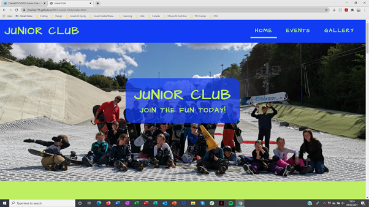

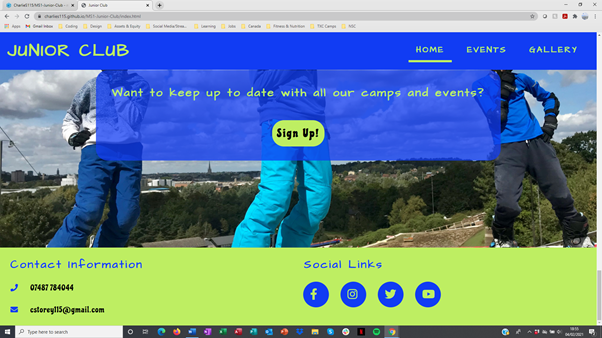
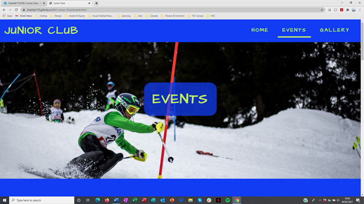

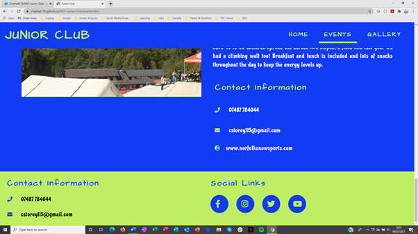
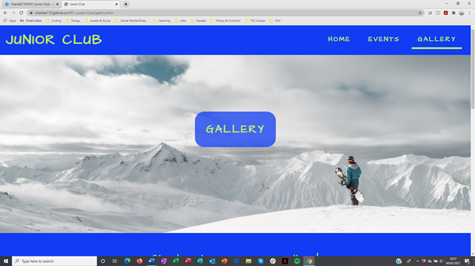
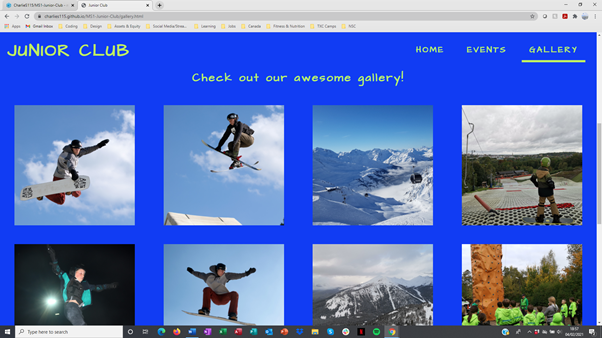
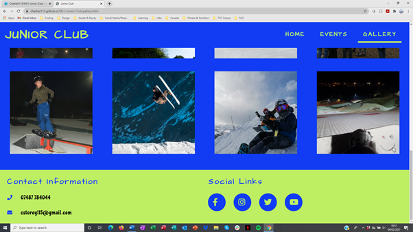

Back to [Table of Contents](#table-of-contents)

---
---